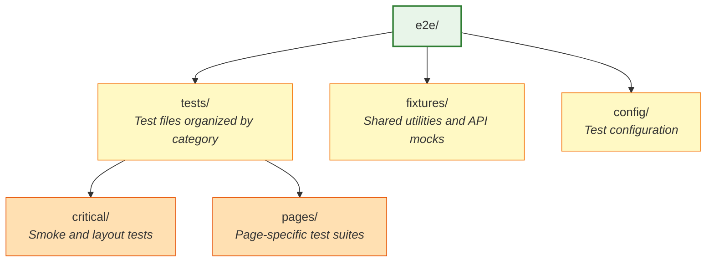

# Web Development Tools

[](https://github.com/seijikohara/web-dev-tools-vue3/actions)


[](https://opensource.org/licenses/MIT)

A comprehensive collection of web development utilities built with Vue 3, TypeScript, and Vite. This application provides essential tools for common development tasks including data formatting, encoding, hashing, and information retrieval.

## Core Features

### Information Retrieval
- **Dashboard**: System and network diagnostics including User Agent parsing, IP address resolution, geolocation data, RDAP queries, and HTTP header inspection

### Data Formatting and Transformation
- **JSON Formatter**: JSON validation, formatting, and beautification with syntax highlighting
- **XML Formatter**: XML document formatting and structure visualization
- **YAML Formatter**: YAML validation and formatting utilities
- **SQL Formatter**: SQL query formatting with multi-dialect support (MySQL, PostgreSQL, SQLite, etc.)
- **Markdown Editor**: Real-time Markdown rendering with live preview
- **Diff Viewer**: Side-by-side text comparison with highlighting
- **String Case Converter**: Convert text between camelCase, PascalCase, snake_case, kebab-case, and more

### Encoding and Decoding
- **Base64 Encoder**: Base64 encoding and decoding utilities
- **URL Encoding**: Bidirectional URL encoding and decoding utilities
- **HTML Entities**: HTML entity reference lookup and conversion utilities
- **JWT Decoder**: JSON Web Token parsing and validation

### Hash & Cryptography
- **Hash Generator**: Cryptographic hash generation (MD5, SHA-1, SHA-224, SHA-256, SHA-384, SHA-512)
- **BCrypt Generator**: Secure password hashing and verification using BCrypt algorithm
- **SSH Key Generator**: Generate SSH key pairs (RSA, ECDSA, Ed25519)
- **GPG Key Generator**: Generate GPG key pairs for encryption and signing

### Generators
- **UUID Generator**: UUID v1/v4 generation with bulk support
- **Password Generator**: Secure random password generation with customizable options
- **QR Code Generator**: Generate QR codes from text, URLs, vCard, WiFi config with PNG/SVG export
- **Cron Builder**: Visual cron expression builder with human-readable descriptions
- **cURL Builder**: Build and parse cURL commands with a visual interface

### Converters
- **Color Converter**: Convert between HEX, RGB, HSL color formats
- **Timestamp Converter**: Unix timestamp and date format conversions

### Testing & Validation
- **Regex Tester**: Regular expression testing with match highlighting

### Network Tools
- **IP Lookup**: IP address geolocation, RDAP queries, and network information

## Technology Stack

### Core Framework
- **Frontend**: Vue 3 (Composition API)
- **Language**: TypeScript (strict mode)
- **Build System**: Vite 7.x

### UI and Styling
- **Component Library**: PrimeVue 4.x
- **CSS Framework**: PrimeFlex 4.x
- **Icons**: PrimeIcons 7.x
- **Theme System**: PrimeUix Themes

### Architecture
- **State Management**: Pinia 3.x
- **Routing**: Vue Router 4.x
- **Composables**: VueUse utilities

### Quality Assurance
- **Unit Testing**: Vitest 4.x with coverage support
- **E2E Testing**: Playwright 1.x (end-to-end)
- **Linting**: ESLint 9.x with TypeScript support
- **Code Formatting**: Prettier 3.x

### Utilities and Libraries
- **HTTP Client**: Axios
- **Date/Time**: Day.js
- **Security**: DOMPurify (XSS prevention), bcryptjs (password hashing), crypto-js
- **Code Editor**: vue-codemirror6 (CodeMirror 6 integration)
- **Markdown**: marked (parsing and rendering)
- **XML**: xml-formatter
- **SQL**: sql-formatter (multi-dialect SQL formatting)
- **QR Code**: qrcode (QR code generation)

## Recommended IDE Setup

### Visual Studio Code (Recommended)

[Visual Studio Code](https://code.visualstudio.com/) with the following extensions:

- **[Vue - Official](https://marketplace.visualstudio.com/items?itemName=Vue.volar)** (formerly known as Volar) - The official Vue language support extension that provides:
  - TypeScript support for Vue Single File Components (SFCs)
  - Syntax highlighting and IntelliSense
  - Type checking and error diagnostics
  - Auto-completion for template expressions and component props
  - Code formatting and refactoring tools

**Note**: Vetur (the previous Vue 2 extension) must be disabled in Vue 3 projects to prevent conflicts with Vue - Official extension.

### Alternative IDEs

- **[WebStorm](https://www.jetbrains.com/webstorm/)** - Built-in TypeScript and Vue support with Volar integration (version 2023.2+)

## Type Support for `.vue` Imports in TypeScript

TypeScript cannot handle type information for `.vue` imports by default. This project uses `vue-tsc` (a TypeScript CLI wrapper) for type checking Vue components.

The **Vue - Official** extension automatically provides TypeScript language service support for `.vue` files in your editor, enabling:
- Type inference for component props, emits, and slots
- Import path auto-completion
- Type checking in template expressions
- Jump to definition for components and composables

## Prerequisites

- Node.js >= 22.12.0
- npm >= 11.0.0

## Installation

Install project dependencies using npm:

```sh
npm install
```

For Playwright browser binaries (required for E2E testing):

```sh
npm run test:e2e:install
```

## Development Commands

### Development Server

```sh
# Start local development server with HMR
npm run dev

# Start development server accessible on local network
npm run dev:host

# Enable continuous type checking
npm run type-check:watch
```

### Production Build

```sh
# Full production build with type checking
npm run build

# Build without type checking (faster, use cautiously)
npm run build-only

# Generate bundle analysis report
npm run build:analyze

# Serve production build locally
npm run preview
```

### Testing

#### Unit Tests (Vitest)

```sh
# Run unit tests in watch mode
npm run test

# Execute unit test suite once
npm run test:run

# Run tests with coverage report
npm run test:coverage

# Launch Vitest UI for interactive testing
npm run test:ui
```

#### End-to-End Tests (Playwright)

```sh
# Execute end-to-end test suite
npm run test:e2e

# Launch Playwright UI for interactive testing
npm run test:e2e:ui

# Run tests with visible browser windows
npm run test:e2e:headed

# Start debugging session for test development
npm run test:e2e:debug

# Display HTML test results report
npm run test:e2e:report

# Launch Playwright test generator
npm run test:e2e:codegen

# Install required browser binaries
npm run test:e2e:install
```

For comprehensive information about the E2E testing setup, see the [E2E Testing Guide](e2e/README.md).

### Code Quality

```sh
# Perform TypeScript type checking
npm run type-check

# Lint source code with automatic fixes
npm run lint

# Lint without modifying files
npm run lint:check

# Format code using Prettier
npm run format

# Verify code formatting compliance
npm run format:check
```

### Project Maintenance

```sh
# Remove build artifacts and cache files
npm run clean

# Audit for available dependency updates
npm run deps:check

# Update all dependencies to latest versions
npm run deps:update
```

## Project Structure

```mermaid
graph TD
    src["src/"]

    src --> api["api/<br/><i>API client and endpoints</i>"]
    src --> components["components/<br/><i>Reusable Vue components</i>"]
    src --> composables["composables/<br/><i>Composition API logic</i>"]
    src --> constants["constants/<br/><i>Application constants</i>"]
    src --> router["router/<br/><i>Vue Router configuration</i>"]
    src --> stores["stores/<br/><i>Pinia state management</i>"]
    src --> types["types/<br/><i>TypeScript definitions</i>"]
    src --> utils["utils/<br/><i>Utility functions</i>"]
    src --> views["views/<br/><i>Tool feature views</i>"]
    src --> workers["workers/<br/><i>Web Workers</i>"]
    src --> assets["assets/<br/><i>Static assets and styles</i>"]

    style src fill:#e3f2fd,stroke:#1976d2,stroke-width:2px
    style api fill:#fff3e0,stroke:#e65100,stroke-width:1px
    style components fill:#fff3e0,stroke:#e65100,stroke-width:1px
    style composables fill:#fff3e0,stroke:#e65100,stroke-width:1px
    style constants fill:#fff3e0,stroke:#e65100,stroke-width:1px
    style router fill:#fff3e0,stroke:#e65100,stroke-width:1px
    style stores fill:#fff3e0,stroke:#e65100,stroke-width:1px
    style types fill:#fff3e0,stroke:#e65100,stroke-width:1px
    style utils fill:#fff3e0,stroke:#e65100,stroke-width:1px
    style views fill:#fff3e0,stroke:#e65100,stroke-width:1px
    style workers fill:#fff3e0,stroke:#e65100,stroke-width:1px
    style assets fill:#fff3e0,stroke:#e65100,stroke-width:1px
```



## Environment Configuration

The application supports optional environment-specific configuration. Create a `.env` file in the project root directory using [`.env.example`](.env.example) as a template:

```env
# Google Analytics Measurement ID (optional)
VUE_APP_GA_MEASUREMENT_ID=G-XXXXXXXXXX

# Development settings
NODE_ENV=development
VITE_DEV_PORT=5173

# API Configuration (optional)
# VUE_APP_API_BASE_URL=http://localhost:3000/api

# Vue Router history mode: 'hash' or 'history' (optional, defaults to 'history')
# VUE_APP_HISTORY_MODE=history
```

## Testing Strategy

The project implements a two-tier testing strategy:
- **Unit tests**: Vitest for testing composables and utility functions
- **End-to-end tests**: Playwright for detecting regressions through basic functionality verification

### Testing Approach

- **Essential user flows**: Focus on critical paths rather than comprehensive coverage
- **Speed and maintainability**: Prioritize fast execution and easy maintenance
- **Clear diagnostics**: Provide actionable failure information
- **Best practices**: Follow Playwright community guidelines

### Testing Capabilities

- **Cross-browser testing**: Chromium, Firefox, WebKit, and mobile viewports (Pixel 5, iPhone 13)
- **API mocking**: Playwright route mocking for deterministic responses
- **Continuous integration**: Automated test execution via GitHub Actions
- **Test coverage**: Critical user flows and page-specific functionality validation

### Test Organization



For detailed information about writing and running E2E tests, see the [E2E Testing Guide](e2e/README.md).

## Continuous Integration

GitHub Actions workflows are configured for automated quality assurance:

- **ci.yml**: Unit tests, build verification, and type checking across Node.js 22.x and 24.x
- **playwright.yml**: Multi-browser end-to-end test execution
- **dependency-review.yml**: Security gate for Renovate dependency update PRs

## Build Configuration

The project uses Vite as its build tool. For advanced configuration options, refer to the [Vite Configuration Reference](https://vitejs.dev/config/).

Build configuration can be customized in [`vite.config.ts`](vite.config.ts).

## License

This project is licensed under the MIT License - see the [LICENSE](LICENSE) file for details.
