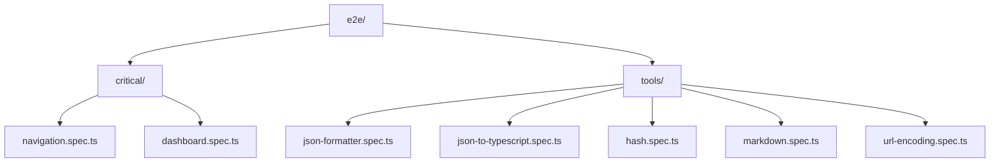
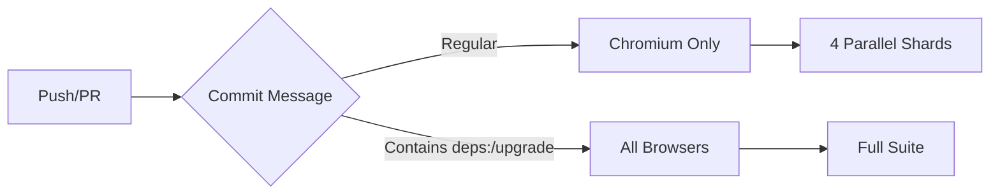

# E2E Testing with Playwright

This directory contains End-to-End (E2E) tests for the Web Development Tools application. The tests are built using [Playwright](https://playwright.dev/), a modern testing framework that supports multiple browsers and provides excellent developer experience.

## Table of Contents

- [Overview](#overview)
- [Test Structure](#test-structure)
- [Getting Started](#getting-started)
- [Running Tests](#running-tests)
- [Writing Tests](#writing-tests)
- [Best Practices](#best-practices)
- [CI/CD Integration](#cicd-integration)
- [Troubleshooting](#troubleshooting)
- [Test Reports](#test-reports)
- [Resources](#resources)
- [Contributing](#contributing)

## Overview

The E2E test suite covers the following areas:

- **Critical Paths**: Navigation, routing, and core functionality
- **Tool Features**: All development tools (JSON formatter, hash generator, etc.)
- **Responsive Design**: Mobile and desktop viewports
- **Error Handling**: Graceful degradation and error states
- **Cross-Browser**: Chromium, Firefox, and WebKit (Safari)

### Test Coverage



## Getting Started

### Prerequisites

- Node.js >= 24.0.0
- npm >= 11.0.0

### Installation

```bash
# Install dependencies (includes Playwright)
npm install

# Install Playwright browsers
npm run test:e2e:install
```

This command will download Chromium, Firefox, and WebKit browsers required for testing.

## Running Tests

### Basic Commands

```bash
# Run all E2E tests (headless mode)
npm run test:e2e

# Run tests with UI mode (recommended for development)
npm run test:e2e:ui

# Run tests in headed mode (see browser)
npm run test:e2e:headed

# Debug mode (pause on failures)
npm run test:e2e:debug

# View test report
npm run test:e2e:report
```

### Advanced Options

```bash
# Run specific test file
npx playwright test e2e/critical/navigation.spec.ts

# Run specific test by name
npx playwright test -g "should navigate to all tools"

# Run tests for specific browser
npx playwright test --project=chromium
npx playwright test --project=firefox
npx playwright test --project=webkit

# Run tests in parallel
npx playwright test --workers=4

# Run only failed tests
npx playwright test --last-failed

# Update snapshots (if using visual regression)
npx playwright test --update-snapshots
```

## Writing Tests

### Test Structure

```typescript
import { test, expect } from '@playwright/test'

test.describe('Feature Name', () => {
  test.beforeEach(async ({ page }) => {
    // Setup before each test
    await page.goto('/tool-page')
  })

  test('should do something', async ({ page }) => {
    // Arrange
    const input = page.locator('input[type="text"]')

    // Act
    await input.fill('test value')
    await page.click('button:has-text("Submit")')

    // Assert
    await expect(page.locator('.result')).toHaveText('Expected output')
  })
})
```

### Locator Best Practices

```typescript
// Good practice - Use semantic selectors
page.locator('button', { hasText: 'Submit' })
page.getByRole('button', { name: /submit/i })
page.getByLabel('Email address')
page.getByTestId('submit-button')

// Poor practice - Brittle selectors
page.locator('.btn.btn-primary.submit-btn')
page.locator('div > div > button:nth-child(3)')
```

### Waiting for Elements

```typescript
// Recommended - Playwright auto-waits, no explicit waits needed
await page.click('button')
await expect(page.locator('.result')).toBeVisible()

// Use with caution - Only when necessary
await page.waitForTimeout(1000) // Last resort
await page.waitForLoadState('networkidle') // For API calls
```

### Code Generation

Use Playwright's code generator to quickly create test scripts:

```bash
# Start code generator
npm run test:e2e:codegen

# Generator will open browser and record your actions
# Copy generated code into your test files
```

## Best Practices

### 1. Test Independence

Each test should be independent and not rely on other tests:

```typescript
// Good practice - Self-contained
test('should format JSON', async ({ page }) => {
  await page.goto('/json-formatter')
  // Complete test in isolation
})

// Poor practice - Depends on previous test
test('should show result', async ({ page }) => {
  // Assumes we're already on the page
})
```

### 2. Use Page Object Model for Complex Pages

```typescript
// utils/page-objects/json-formatter.ts
export class JsonFormatterPage {
  constructor(private page: Page) {}

  async goto() {
    await this.page.goto('/json-formatter')
  }

  async formatJson(input: string) {
    await this.page.locator('textarea').fill(input)
    await this.page.click('button:has-text("Format")')
  }

  async getOutput() {
    return this.page.locator('.output').textContent()
  }
}

// In test file
test('should format JSON', async ({ page }) => {
  const formatter = new JsonFormatterPage(page)
  await formatter.goto()
  await formatter.formatJson('{"test": "value"}')
  const output = await formatter.getOutput()
  expect(output).toContain('"test"')
})
```

### 3. Handle Flaky Tests

```typescript
// Use retries for flaky tests (configured in playwright.config.ts)
// CI environment: 2 retries
// Local environment: 0 retries

// For specific test:
test('flaky test', async ({ page }) => {
  test.fixme() // Skip this test temporarily
  // or
  test.slow() // Increase timeout for slow test
})
```

### 4. Test Data Management

```typescript
// Good practice - Use fixtures for test data
import { test } from '@playwright/test'

const TEST_DATA = {
  validJson: '{"name": "test", "value": 123}',
  invalidJson: '{invalid}',
  largeJson: JSON.stringify({ /* large object */ }),
}

test('should handle valid JSON', async ({ page }) => {
  await page.fill('textarea', TEST_DATA.validJson)
})
```

### 5. Accessibility Testing

```typescript
// Optional: Add accessibility testing
import { test, expect } from '@playwright/test'
import AxeBuilder from '@axe-core/playwright'

test('should not have accessibility violations', async ({ page }) => {
  await page.goto('/dashboard')

  const accessibilityScanResults = await new AxeBuilder({ page }).analyze()

  expect(accessibilityScanResults.violations).toEqual([])
})
```

## CI/CD Integration

### GitHub Actions Workflows

The project includes two CI workflows for E2E testing:



#### 1. Regular E2E Tests

Configured in [`.github/workflows/playwright.yml`](../.github/workflows/playwright.yml):

- Runs on every push and pull request
- Uses 4 parallel shards for faster execution
- Tests on Chromium by default
- Generates HTML report as artifact

#### 2. Dependency Regression Tests

Automatically triggered when commit message contains:
- `deps:`
- `dependencies`
- `upgrade`

Behavior:
- Tests **all browsers** (Chromium, Firefox, WebKit)
- Full test suite execution
- Ensures no regressions after dependency updates

### Triggering Dependency Tests

```bash
# Commit with special keywords to trigger full browser testing
git commit -m "deps: upgrade Vue to 3.5.23"
git commit -m "dependencies: update all packages"
git commit -m "upgrade: bump Playwright to latest"
```

### Viewing Test Results in CI

1. Navigate to GitHub Actions tab in the repository
2. Click on the workflow run
3. Download artifacts: `playwright-report-*` and `test-results-*`
4. Extract the archive and open `index.html` for visual report

## Troubleshooting

### Common Issues

#### 1. Tests failing with "Timeout waiting for..."

```typescript
// Solution: Increase timeout for specific test
test('slow test', async ({ page }) => {
  test.setTimeout(60000) // 60 seconds

  await page.goto('/slow-page')
})
```

#### 2. Browser installation fails

```bash
# Clear and reinstall
rm -rf ~/.cache/ms-playwright
npm run test:e2e:install
```

#### 3. Tests pass locally but fail in CI

```bash
# Run tests in headless mode locally (same as CI)
npm run test:e2e

# Check for timing issues - CI might be slower
# Add waitForLoadState in tests:
await page.waitForLoadState('networkidle')
```

#### 4. Port 5173 already in use

```bash
# Kill process using port 5173
lsof -ti:5173 | xargs kill -9

# Or configure different port in playwright.config.ts
```

See [`../playwright.config.ts`](../playwright.config.ts) for complete configuration.

### Debug Mode

```bash
# Run with browser and inspector
npm run test:e2e:debug

# Pause on failure
npx playwright test --debug

# Screenshot on failure (already configured)
# Check test-results/ directory for screenshots
```

### Trace Viewer

When tests fail in CI, download trace files and analyze:

```bash
npx playwright show-trace trace.zip
```

The trace viewer provides timeline of test execution with:
- Network requests
- Console logs
- DOM snapshots
- Screenshots at each action

## Test Reports

### HTML Report

After running tests, generate and view the interactive HTML report:

```bash
npm run test:e2e:report
```

The report includes:
- Test results by browser
- Failed test screenshots
- Test traces
- Timing information
- Test statistics

### JUnit Report

For CI integration, JUnit XML is generated at:

```
test-results/junit.xml
```

### JSON Report

Machine-readable results are available at:

```
test-results/results.json
```

## Resources

- [Playwright Documentation](https://playwright.dev/)
- [Best Practices Guide](https://playwright.dev/docs/best-practices)
- [API Reference](https://playwright.dev/docs/api/class-playwright)
- [Community Discord](https://discord.com/invite/playwright-807756831384403968)
- [GitHub Discussions](https://github.com/microsoft/playwright/discussions)

## Contributing

When adding new E2E tests to this project:

1. Follow the existing test structure and patterns
2. Use descriptive test names that clearly indicate the test purpose
3. Keep tests focused and independent
4. Add appropriate error handling and assertions
5. Update this README if adding new test categories or significant changes
6. Ensure tests pass locally before creating pull requests

For more information on the overall project structure, see the [main README](../README.md).

## License

Same as the main project. See [LICENSE](../LICENSE).
